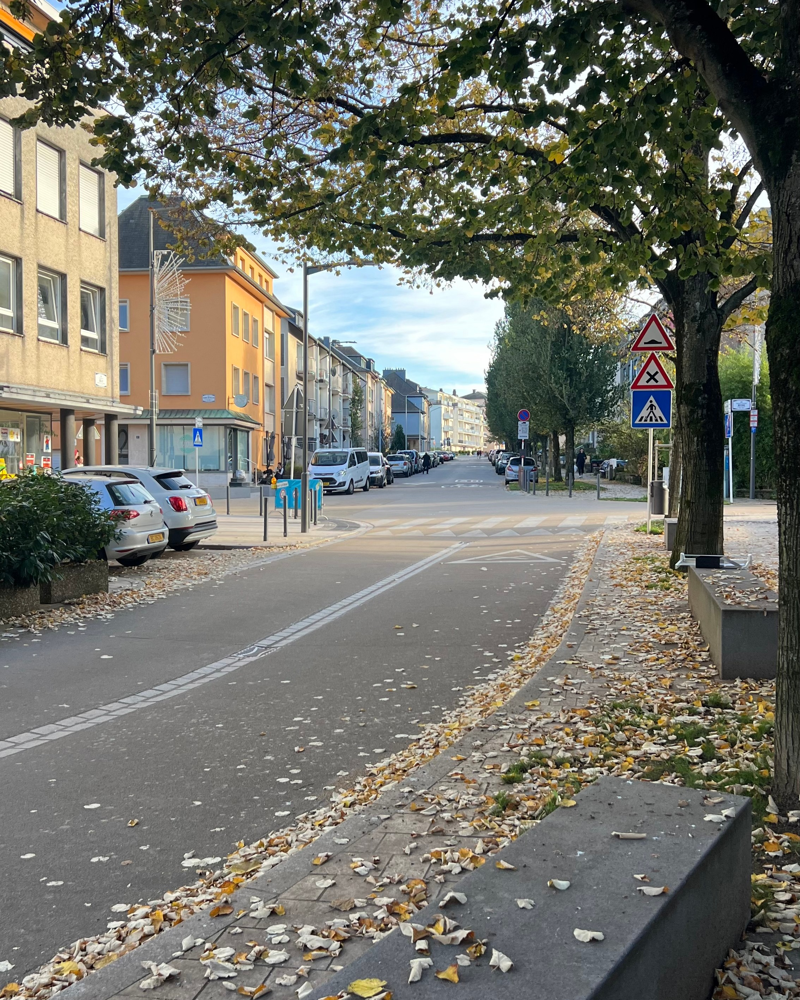

# Qwen3 VL Family Benchmark — Visual Description Task

> **Test image:** Autumn street scene, Luxembourg  
> **Prompt:** "Describe this image in detail."  
> **Hardware:** Radxa RK3588 (NPU via RKLLM)  
> **Reference:** Claude Sonnet 4.6 — 100/100

---

## Results

| Model | Resolution | Vision Size | LLM Size | Total Size | Quality | Gen Time | Tok/s (est.) |
|---|---|---|---|---|---|---|---|
| Claude Sonnet 4.6 | Cloud | — | — | Cloud | **100/100** | ~3–5 sec | ~200–400 |
| Qwen3-VL-8B Custom Built | 896px | 1.27 GB | 8.3 GB | **9.6 GB** | **90/100** | 4m 11s | ~2.5 |
| Qwen3-VL-4B Custom Built | 896px | 985 MB | 4.6 GB | **5.5 GB** | **86/100** | 2m 11s | ~3.5 |
| Qwen3-VL-4B Vendor | 448px | 827 MB | 4.6 GB | **5.4 GB** | **86/100** | 1m 53s | ~3.5 |
| Qwen3-VL-2B Custom Built | 896px | 969 MB | 2.3 GB | **3.3 GB** | **86/100** | 0m 59s | ~5.5 |
| Qwen3-VL-8B Custom Built | 448px | 1.14 GB | 8.3 GB | **9.4 GB** | **82/100** | 2m 31s | ~4.0 |
| Qwen3-VL-2B GatekeeperZA | 896px | 923 MB | 2.3 GB | **3.2 GB** | **82/100** | 1m 7s | ~5.0 |

---

## Scoring Criteria

| Criterion | Max |
|---|---|
| Accuracy | 20 |
| Detail | 20 |
| Errors / Hallucinations | 20 |
| Structure & Clarity | 20 |
| Location / Context Awareness | 20 |
| **Total** | **100** |

---

## Key Findings

**Best quality:** Qwen3-VL-8B Custom Built 896px — 90/100, only local model to close meaningfully on Claude.

**Best value (quality/size/speed):** Qwen3-VL-2B Custom Built 896px — matches 4B and 4B Vendor at 86/100 in under 1 minute, at 3.3 GB total.

**Resolution impact:** At 8B scale, dropping from 896px to 448px costs 8 quality points (90→82) but saves 1m 40s. At 4B scale, 448px vendor matches 896px custom — higher resolution yields no benefit.

**Recurring weakness across all local models:** European traffic sign interpretation remains poor. None correctly identified the level crossing warning (X triangle) or pedestrian ahead warning, which Claude identified correctly.